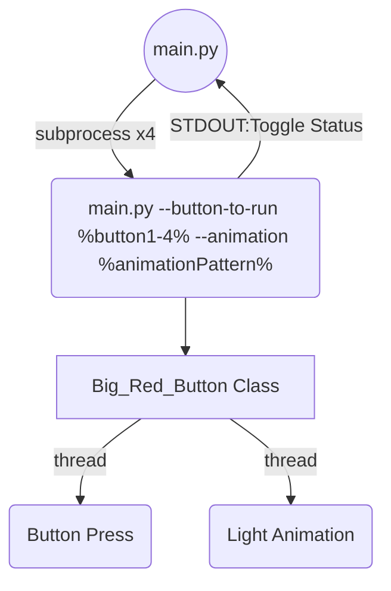

# Big Red Button Project

This project is used to run a fun former hydraulic pump control panel

## Requirements
Python 3.x
Raspberry pi 3 or greater

## Run Local
pip install -r requirements.txt
./main.py

## Docker

docker build ./ --label bigred
docker run bigred --device /dev/i2c-1
docker run --privileged bigred

## Internal Structure
 - main.py can be run for a single button, or can self reference and subprocess for each button (4 buttons)
 - Each button spawns 2 threads, one for animation and one to watch the button
 - main.py will eventually use the status reported back to it to drive system automation

Big_Red_Button class creates 2 threads for running lights and waiting for button presses
This class when called can have output set to communicate toggle status back to STDOUT for processing in main.py above